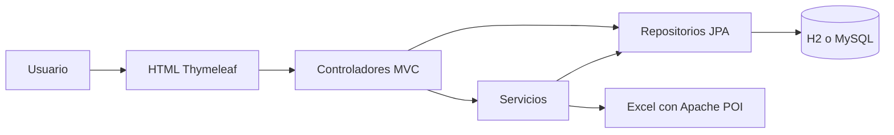
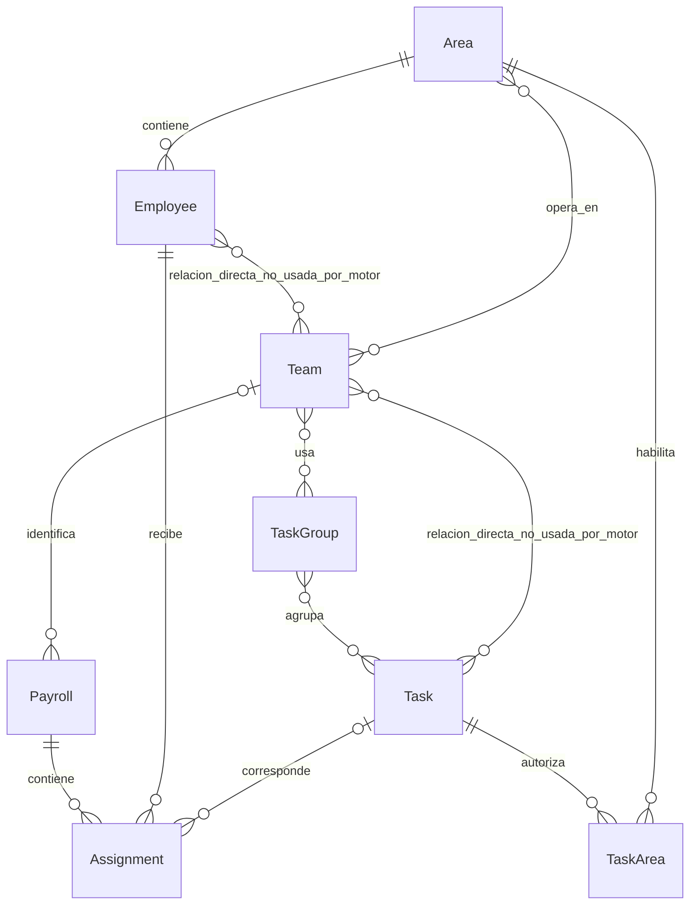

# Memoria técnica de TaskScheduler

**Estado local posterior a la revisión original (27 de septiembre de 2026):** se corrigió `AssignmentAlgorithm` para validar 1–52 semanas antes de archivar y asignar las tareas antes de decidir los descansos, con reubicación interna de personas cuando una elección previa bloquea una tarea compatible. No se añadió ninguna librería de optimización. `PayrollController` muestra los errores de generación en la vista. `mvn test -B -ntp` ejecutó 11 pruebas: 11 correctas, 0 fallidas. La descripción vigente del motor está en [docs/ALGORITMO.md](docs/ALGORITMO.md); los hallazgos y conteos de la revisión inicial más abajo son históricos y describen el estado anterior a estas correcciones.

**Suite unitaria añadida el 27 de septiembre de 2026:** `AssignmentAlgorithmUnitTests` ejecuta diez casos con Mockito, sin Spring ni base de datos. Detectó que el motor repetía la última tarea aunque el empleado tuviera otra alternativa. Se corrigió la clasificación de tareas para procesar primero aquellas con candidatos ideales y conservar después los niveles de relajación. La suite completa queda en 21 pruebas: 21 correctas, 0 fallidas. La causa, la corrección y el contrato del test están documentados en [docs/PLAN_TESTING.md](docs/PLAN_TESTING.md).

**Producción verificada el 27 de septiembre de 2026:** un Web Service Docker gratuito de Render en Ohio construye la rama `main` de GitHub y se conecta mediante JDBC/TLS a MySQL 8.4.8 administrado por Aiven en `sfo`. El 28 de septiembre de 2026 se enviaron a `origin/main` los cambios hasta `0009945`; el último despliegue comprobado sigue siendo `a6c2033`, por lo que el estado de Render después del envío permanece pendiente de verificación. La topología, variables por nombre, límites y enlaces operativos están en [docs/DESPLIEGUE.md](docs/DESPLIEGUE.md). No guardar secretos de Render o Aiven en esta memoria.

**Registro permanente de cambios:** cada evolución funcional, de pruebas o infraestructura debe añadirse a [docs/EVOLUCION.md](docs/EVOLUCION.md), indicando su validación y estado de commit/despliegue. El 27 de septiembre de 2026 se hizo configurable el entorno Docker Compose local; `pom.xml` ya contenía una sola dependencia `mysql-connector-j`, por lo que se conservó esa declaración necesaria.

**Entidades JPA ajustadas el 27 de septiembre de 2026:** las ocho entidades usan `@Getter` y `@Setter` en lugar de `@Data`, de modo que Lombok ya no incorpora asociaciones bidireccionales en `equals`, `hashCode` o `toString`. La clave compuesta `TaskAreaId` conserva `@EqualsAndHashCode`, requerido para su identidad JPA. La suite completa continúa en 21 pruebas correctas y 0 fallidas.

Revisión: 26 de septiembre de 2026. Idioma de trabajo: español.

## Alcance y referencia verificada

Este documento conserva el conocimiento de la aplicación: propósito, tecnologías, estructura, datos, recorridos de uso, configuración y limitaciones observadas. Es memoria persistente dentro del proyecto, que futuras sesiones pueden consultar; no implica una memoria global automática fuera de esta carpeta.

Repositorio: [AgustinG1/task-scheduler-DEMO-0.2](https://github.com/AgustinG1/task-scheduler-DEMO-0.2). Rama consultada: `main`. Commit: [`a6c203360fcd1da6d218bb849782019c6d8fa057`](https://github.com/AgustinG1/task-scheduler-DEMO-0.2/commit/a6c203360fcd1da6d218bb849782019c6d8fa057), «Ajustar perfiles y Docker para producción», del 18 de junio de 2026, 03:33:43 UTC. Árbol Git: `841a4b22543094c55360ce32a9b73e5cca5e1bb4`.

La copia descargada no contiene `.git`. Se compararon los 71 archivos originales con los hashes de blobs obtenidos de GitHub: 70 coinciden byte por byte; `mvnw.cmd` coincide al normalizar CRLF a LF, conforme a `.gitattributes`. No faltaban archivos ni había archivos locales adicionales antes de esta revisión. La lectura web inicial falló, pero la conexión integrada de GitHub permitió completar la comprobación.

Se leyeron todas las fuentes, plantillas, configuraciones y documentos de texto. De `intro.docx` se extrajo el contenido y se inspeccionaron sus tres diagramas incrustados. Se consultaron esquema y agregados de una copia de la base H2 histórica en modo de solo lectura. No se modificaron archivos originales de aplicación ni la base histórica. Las únicas incorporaciones permanentes son estos documentos y las instrucciones para encontrarlos; las compilaciones y comprobaciones temporales quedaron bajo `target/`.

Documentos complementarios:

- [Algoritmo actual explicado paso a paso](docs/ALGORITMO.md).
- [Comprobaciones ejecutadas y resultados](docs/VERIFICACION.md).
- [Inventario completo y huellas de los archivos originales](docs/INVENTARIO_ARCHIVOS.md).
- [Arquitectura y operación del despliegue Render–Aiven](docs/DESPLIEGUE.md).

## Qué hace la aplicación

Es un monolito web para configurar áreas de trabajo, empleados, tareas, catálogos de tareas y equipos o sucursales, y generar una matriz de asignaciones semanales. Cada empleado incluido recibe una tarea o un descanso por semana. La matriz puede descargarse como Excel y se conserva un historial de planillas.

Aunque las clases se llaman `Payroll` y algunas pantallas hablan de «nómina», no hay cálculo de salarios, pagos ni remuneraciones. Tampoco hay un programador de trabajos automáticos: la generación se dispara mediante una petición del usuario. No se encontraron `@Scheduled`, colas, cron ni motores externos de optimización.

Recorrido práctico: crear áreas → registrar empleados en sus áreas → crear tareas generales o específicas → agrupar tareas en catálogos → crear un equipo con áreas y catálogos → elegir equipo y cantidad de semanas → generar → consultar o exportar.

## Tecnologías y versiones

| Componente | Tecnología verificada | Función |
|---|---|---|
| Lenguaje objetivo | Java 17, según `pom.xml` | Modelo, controladores y algoritmo |
| Plataforma | Spring Boot 4.0.6 | Arranque y autoconfiguración |
| Web | Spring MVC 7.0.7; Tomcat embebido 11.0.21 | HTTP y páginas renderizadas en servidor |
| Persistencia | Spring Data JPA; Hibernate ORM 7.2.12.Final | Repositorios y relaciones |
| Plantillas | Thymeleaf 3.1.5.RELEASE | HTML dinámico; integración `thymeleaf-spring6` resuelta por Boot |
| Validación | Jakarta Bean Validation y starter de validación | Restricciones declaradas en entidades |
| Código generado | Lombok 1.18.46 | Constructores, getters y setters; igualdad/hash solo en la clave compuesta |
| Base local | H2 2.4.240 en memoria | Desarrollo y prueba de contexto |
| Base Docker | MySQL 8.4 | Servicio persistente de la demo |
| Conector MySQL | mysql-connector-j 9.7.0 | Conexión a MySQL |
| Exportación | Apache POI / poi-ooxml 5.2.3 | Generación de `.xlsx` |
| Interfaz | Bootstrap 5.3.2, Bootstrap Icons 1.11.3 | Estilos, rejilla y modales, desde CDN |
| Tipografías | DM Sans y JetBrains Mono | Cargadas desde Google Fonts |
| JavaScript | JavaScript nativo incrustado | Menú móvil y selector de área |
| Construcción | Maven; Wrapper 3.3.4 que descarga Maven 3.9.15 | Compilación, pruebas y empaquetado |
| Contenedores | Dockerfile multietapa y Docker Compose | Aplicación y MySQL |
| Pruebas | JUnit Jupiter 6.0.3, soporte de Spring Boot | Una prueba de carga del contexto |

Las versiones transitivas se verificaron en el classpath de la prueba ejecutada. La máquina de revisión utilizó JDK 22.0.1 y Maven 3.9.11 instalados, compilando con `release 17`. No se ejecutó el Wrapper ni se validó el contenedor con JDK 17 en esta revisión. No hay Node/npm, React, Angular, Vue ni compilación independiente de frontend.

## Estructura y responsabilidades

Paquete raíz: `com.taskapp.task_scheduler`. Coordenadas Maven: `com.taskapp:task-scheduler:0.0.1-SNAPSHOT`.

| Carpeta o archivo | Contenido |
|---|---|
| `TaskSchedulerApplication.java` | Punto de entrada `@SpringBootApplication` |
| `controller/` | 8 controladores: 7 MVC y 1 de descarga con `@RestController` |
| `service/` | 7 servicios y un archivo de algoritmos históricos sin compilar |
| `repository/` | 8 interfaces Spring Data JPA |
| `model/` | 8 entidades, una clave compuesta y 3 enumeraciones |
| `config/DataInitializer.java` | Ejemplo completamente comentado, no ejecutable |
| `resources/templates/` | 14 plantillas HTML, incluida la base compartida |
| `resources/application*.properties` | Configuración común y perfiles local, docker y prod |
| `resources/schema.sql` | DDL parcial para 5 tablas de relación |
| `src/test/` | Una clase con `contextLoads()` |
| `data/` | Archivo H2 histórico y trazas antiguas |

Conteo original: 37 archivos Java en `src/main` (uno enteramente comentado), uno en `src/test`, 2.063 líneas Java, 2.003 líneas HTML, 47 de propiedades, 34 de SQL y 595 de texto histórico del algoritmo. El motor actual ocupa 224 líneas. No se encontraron workflows de CI, migraciones Flyway/Liquibase ni código de autenticación.



La separación por capas es parcial: equipos y catálogos gestionan relaciones directamente desde sus controladores. Las entidades se usan como objetos de formulario y como datos de las vistas; no hay DTOs ni manejador global de excepciones. Las dependencias se inyectan por constructor mediante `@RequiredArgsConstructor`.

## Modelo de datos

| Clase / tabla | Campos y relaciones esenciales |
|---|---|
| `Area` / `areas` | `id`, `nombre` obligatorio (100), `descripcion` (255), colección inversa de equipos |
| `Employee` / `empleados` | `id`, `name`/columna `nombre` obligatorio (100), `apellido` (100), `active=true`, un área obligatoria, lista de equipos |
| `Task` / `tareas` | `id`, `name` obligatorio (100), `description` (255), `type`, áreas autorizadas, equipos y catálogos |
| `TaskArea` / `tarea_area` | Vínculo tarea–área; clave `TaskAreaId(taskId, areaId)` con `@EmbeddedId` y `@MapsId` |
| `TaskGroup` / `catalogos_tareas` | `id`, `name` obligatorio (100), `description` (255), tareas y equipos |
| `Team` / `equipos` | `id`, nombre obligatorio y único (100), descripción, áreas y catálogos; relaciones inversas con empleados y tareas |
| `Payroll` / `planillas` | `id`, inicio, fin, estado, `generatedAt=LocalDateTime.now()`, equipo opcional |
| `Assignment` / `asignaciones` | `id`, número de semana, estado, planilla y empleado obligatorios, tarea opcional |

Enumeraciones persistidas como texto: `TaskType={GENERAL,SPECIFIC}`, `PayrollStatus={ACTIVE,ARCHIVED}` y `AssignmentStatus={ASSIGNED,REST,MANUALLY_MODIFIED}`. El último estado existe en el modelo, pero no hay flujo ni endpoint que lo establezca.

Cinco relaciones muchos a muchos:

| Tabla puente | Lado propietario en JPA |
|---|---|
| `catalogo_tarea_detalle(catalogo_id,tarea_id)` | `TaskGroup.tasks` |
| `equipo_catalogo(equipo_id,catalogo_id)` | `Team.taskGroups` |
| `equipo_area(equipo_id,area_id)` | `Team.areas` |
| `empleado_equipo(empleado_id,equipo_id)` | `Employee.teams` |
| `tarea_equipo(tarea_id,equipo_id)` | `Task.teams` |

La pertenencia operativa del motor se determina por `Employee.area ∈ Team.areas`. Las tareas salen de la unión de `Team.taskGroups[*].tasks`. Por tanto, `Employee.teams` y `Task.teams` no se usan para seleccionar participantes ni tareas. Dos equipos que comparten áreas comparten los empleados activos de esas áreas, sin asignación individual adicional. El panel del equipo también muestra empleados por área, incluidos los inactivos.

`Task.authorizedAreas` se carga con `EAGER`; las colecciones muchos a muchos conservan la carga diferida predeterminada. La ejecución confirmó Open EntityManager in View activo: las vistas pueden disparar consultas adicionales. No hay paginación ni consultas con proyecciones específicas.



## Repositorios y servicios

Los ocho repositorios extienden `JpaRepository`. Las consultas específicas son: áreas por nombre; empleados por área, por área activa o todos los activos; tareas por tipo; asignaciones por planilla, empleado o tarea; planillas por estado; y eliminación de autorizaciones por tarea. `PayrollRepository.findByStatus` devuelve `List<Payroll>`, no `Optional`.

| Servicio | Comportamiento |
|---|---|
| `AreaService` | CRUD simple; borrar no limpia referencias dependientes |
| `EmployeeService` | CRUD, alta siempre activa, desactivación lógica y borrado físico directo |
| `TaskService` | CRUD, vinculación tarea–área; al borrar transforma asignaciones históricas de esa tarea en descanso |
| `FeasibilityValidator` | Solo rechaza listas nulas o vacías de empleados o tareas |
| `AssignmentAlgorithm` | Generación transaccional de planillas por equipo y semanas; ver documento específico |
| `PayrollService` | Obtiene primera activa, lista todas, elimina planilla y sus asignaciones |
| `ExcelExportService` | Construye la matriz semanal en un libro OOXML en memoria |

`PayrollService.archiveCurrentAndCreate()` es un método alternativo que crea una planilla vacía de 16 semanas, sin equipo; no tiene llamadas desde el flujo actual. No confundirlo con `AssignmentAlgorithm.generatePayroll(int totalWeeks, Long teamId)`.

Transacciones explícitas: generación del motor, borrado de tarea, borrado de planilla y borrado de catálogo. Otras operaciones compuestas se apoyan en transacciones individuales de repositorios, por ejemplo crear una tarea y después vincular el área no constituye una sola operación transaccional a nivel de servicio.

## Rutas y pantallas

Se usan formularios HTML y redirecciones. No existe la API `/api/v1/` propuesta en `intro.docx`.

| Módulo | Rutas implementadas |
|---|---|
| Inicio | `GET /` |
| Áreas | `GET /areas`; `POST /areas/guardar`; `GET` y `POST /areas/editar/{id}`; `GET /areas/eliminar/{id}` |
| Empleados | `GET /employees`; `POST /employees/guardar`; `GET` y `POST /employees/editar/{id}`; `GET /employees/desactivar/{id}`; `GET /employees/eliminar/{id}` |
| Tareas | `GET /tasks`; `POST /tasks/guardar`; `GET` y `POST /tasks/editar/{id}`; `GET /tasks/eliminar/{id}` |
| Catálogos | `GET /task-groups`; `POST /task-groups/guardar`; `GET /task-groups/editar/{id}`; `POST /task-groups/actualizar`; `GET /task-groups/eliminar/{id}` |
| Equipos | `GET /teams`; `POST /teams/guardar`; `GET /teams/editar/{id}`; `POST /teams/actualizar`; `GET /teams/eliminar/{id}`; `POST /teams/empleado/actualizar` |
| Planillas | `GET /payroll`; `POST /payroll/generar`; `GET /payroll/historial`; `GET /payroll/eliminar/{id}` |
| Descargas | `GET /payroll/{id}/download` y `GET /api/payrolls/{id}/download` |

El inicio cuenta cuántos de seis módulos tienen al menos un registro; los textos «24/7» y «1 click» son contenido estático. La edición de equipos permite marcar áreas y catálogos; sus modales modifican el área y el estado global del empleado, no una disponibilidad limitada a ese equipo o semana.

La creación de empleados recibe nombre y área; el apellido aparece solo en edición. La creación de tareas específicas permite seleccionar una sola área y no la exige en servidor. La edición de tareas cambia nombre, descripción y tipo, pero no permite gestionar áreas autorizadas: cambiar GENERAL a SPECIFIC puede dejar una tarea sin autorizaciones.

La matriz de planilla muestra semanas como filas, tareas como columnas y una columna de descanso. Sus columnas se obtienen de tareas realmente asignadas, no del catálogo planificado completo. Una tarea nunca cubierta puede desaparecer por completo de la matriz. Si no hay tareas en las asignaciones, se muestran todas las tareas del sistema como alternativa. El historial lista tanto activas como archivadas y permite descargar o borrar; no hay una ruta para abrir la matriz histórica por ID ni para editar manualmente una asignación.

## Interfaz y exportación

`templates/layout/base.html` centraliza el diseño oscuro, variables CSS, navegación, tarjetas, formularios, estados y animaciones. Cada plantilla inserta su contenido usando un fragmento de Thymeleaf. No hay recursos CSS/JS locales separados.

Hay un menú colapsable bajo 992 px. Bajo 768 px, el CSS transforma todas las tablas `.table-dark-custom` en tarjetas, oculta sus cabeceras y usa `data-label` para los títulos. Solo la lista de equipos suministra esos atributos; otras tablas, incluida la matriz, pueden perder el contexto de sus columnas en móvil. Esto se identificó en el código; no se realizó una auditoría visual en navegadores o dispositivos.

La descarga genera un `.xlsx` real llamado `Matriz_Turnos_Pasteleria.xlsx`, con una hoja «Matriz de Turnos», cabecera oscura, filas alternadas, columna de semana y descansos. Se muestran nombres sin apellidos, el primer asignado encontrado por tarea y semana, y descansos unidos con ` - `. No incluye fechas ni nombre del equipo dentro del libro. La interfaz lo llama «CSV», lo que no corresponde al formato entregado.

El servicio de exportación no consulta si la planilla existe. Se confirmó que un ID inexistente produce un Excel con 16 semanas vacías y todas las tareas disponibles. La vista considera descanso cualquier asignación con tarea nula; la exportación filtra por estado `REST`, de modo que datos inconsistentes podrían verse diferentes.

## Configuración y despliegue

| Perfil | Base de datos | Ajustes efectivos |
|---|---|---|
| `local` | `jdbc:h2:mem:taskdb`, compatibilidad MySQL | En memoria, consola H2 habilitada, `ddl-auto=update` |
| `docker` | MySQL por variables `DB_*` | Conexión interna sin TLS, creación de BD si falta, `ddl-auto=update` |
| `prod` | MySQL por variables `DB_*` | `sslMode=REQUIRED`, `ddl-auto=update` |

`prod` es el perfil predeterminado. Los tres perfiles sobrescriben el `ddl-auto=none` del archivo común con `update`. El archivo común activa `spring.sql.init.mode=always` y `spring.jpa.defer-datasource-initialization=true`: la inicialización SQL se difiere hasta después de JPA; el comentario del archivo que sugiere lo contrario es engañoso.

`schema.sql` solo declara cinco tablas puente con un ID autoincremental extra y unicidad del par de referencias. Las entidades no mapean ese ID adicional. Cuando Hibernate crea primero las tablas, el posterior `CREATE TABLE IF NOT EXISTS` no agrega automáticamente ese ID ni los índices únicos del script. La base histórica tiene estas tablas puente sin ID adicional. La estructura puede depender del orden de creación; no hay migraciones versionadas ni comprobación automática de divergencias.

Se necesitan `DB_HOST`, `DB_PORT`, `DB_NAME`, `DB_USERNAME` y `DB_PASSWORD` para MySQL. Los comentarios mencionan Aiven, pero la configuración vigente no fija proveedor, host ni usuario. No se comprobó ningún despliegue externo.

Docker compila con `maven:3.9.6-eclipse-temurin-17`, ejecuta `mvn clean package -DskipTests`, y copia el JAR a `eclipse-temurin:17-jre`. Expone 8080. Compose crea MySQL 8.4 con volumen `mysql_data`, healthcheck y credenciales fijas de demostración; la app espera que MySQL esté sano y publica 8080. No se ejecutó Docker durante la revisión. No hay `.dockerignore`, configuración de CI ni scripts propios de despliegue cloud.

Para desarrollo, desde la carpeta donde está `pom.xml`:

```powershell
$env:SPRING_PROFILES_ACTIVE = "local"
.\mvnw.cmd spring-boot:run
```

Para la prueba existente: `mvn test` o el equivalente del Wrapper. La prueba selecciona explícitamente `local` con `@ActiveProfiles`. Para la demo de contenedores: `docker compose up --build`. La base local en memoria se pierde al terminar el proceso; no carga automáticamente el archivo `data/taskdb.mv.db`.

## Datos y antecedentes incluidos

La base histórica H2 contiene 13 tablas: 3 áreas, 15 empleados, 13 tareas, 2 equipos, 2 catálogos, 13 planillas y 1.000 asignaciones. Hay una planilla activa y 12 archivadas; 860 asignaciones `ASSIGNED` y 140 `REST`, con semanas entre 1 y 30. Los vínculos directos empleado–equipo y tarea–equipo tienen cero filas. Los conteos no implican que el servidor actual utilice esos datos.

`taskdb.trace.db` registra errores antiguos de consultas manuales de mayo de 2026, incluidos errores de sintaxis y un intento fallido de índice parcial para una sola planilla activa. No prueba un error de arranque actual ni que ese índice exista.

`DataInitializer.java` está encerrado completamente en un comentario. Su ejemplo usa una firma `generatePayroll()` que ya no existe y no prepara equipos/catálogos, por lo que no debe activarse sin adaptación. `algoritmoantes.txt` conserva tres variantes históricas y propiedades del antiguo perfil H2 en archivo; Maven no lo compila como Java ni lo usa como configuración.

`intro.docx` plantea un sistema genérico, inicialmente de hasta 5 áreas, 15 empleados y 15 tareas, con 16 semanas, reglas estrictas de no repetición, cobertura del ciclo e intervención manual. Incluye un ER, UML y diagrama de flujo de una versión anterior. No incluye equipos/catálogos en esos modelos y propone rutas que no están implementadas. Los límites 5/15/15 tampoco están impuestos por el código actual.

`analysis_results.md` es una revisión anterior con datos obsoletos. No son válidas hoy sus afirmaciones sobre Compose vacío, conector MySQL duplicado, host/usuario productivo fijos, repositorio que devuelve Optional o ausencia total de pruebas. También cuenta 7 controladores, cuando hay 8. Debe leerse como antecedente, no como autoridad sobre el estado actual.

## Hallazgos para recordar

| Hallazgo | Evidencia y efecto |
|---|---|
| Cobertura incompleta pese a tener personal compatible | Reproducido: la persona especialista puede quedar en el grupo de descanso antes de evaluar tareas |
| Repetición permitida | El tercer nivel del motor permite repetir la última tarea; confirmado con un empleado y una tarea |
| Duración no validada en servidor | Reproducido: cero semanas crea planilla vacía y archiva la anterior; HTML es el único límite 1–52 |
| Activa global | Reproducido: generar para otro equipo archiva todas las activas; coincide con el objetivo original de una activa global, puede sorprender en uso multiequipo |
| Exportación de IDs inexistentes | Reproducido: devuelve matriz vacía en lugar de no encontrado |
| Historial mutable | Borrar tarea convierte asignaciones pasadas en REST; renombrar entidades cambia lo mostrado en planillas antiguas |
| Edición manual pendiente | Existe enumeración, pero no controlador, servicio ni interfaz de edición de asignaciones |
| Autorizaciones de tareas incompletas en formularios | Es posible crear SPECIFIC sin área; la edición no administra vínculos |
| Borrados de áreas, empleados y equipos | Eliminación directa; referencias existentes pueden bloquearla por claves foráneas; no se verificaron todos los casos |
| Concurrencia sin exclusión explícita | No hay bloqueo ni restricción declarada que garantice una única activa ante peticiones simultáneas; riesgo no ensayado |
| Validación y errores | Restricciones de entidad presentes, sin `@Valid`/`BindingResult` en los controladores ni errores de negocio presentados de forma controlada |
| Acceso abierto | No hay autenticación, roles ni Spring Security; el CRUD local respondió sin sesión |
| Mutaciones por GET | Borrados y desactivación usan enlaces GET con confirmación JavaScript en varias pantallas |
| JPA y Lombok | Resuelto el 27 de septiembre de 2026: entidades con `@Getter`/`@Setter`; `TaskAreaId` conserva igualdad/hash de clave compuesta |
| Escalabilidad | Consultas completas, guardados individuales, ordenación repetida y exploración de asignaciones desde las plantillas |
| Documentación y UI | Informe antiguo obsoleto; descarga rotulada CSV; tarjetas móviles con etiquetas incompletas |

Los hallazgos se documentan; esta revisión no los corrigió. No se ejecutó un análisis especializado de vulnerabilidades ni un examen de dependencias por CVE. Tampoco se probaron concurrencia, rendimiento con grandes volúmenes, MySQL o Docker.

## Cómo retomar el trabajo

Para cambios de reglas, comenzar por `AssignmentAlgorithm`, `FeasibilityValidator` y las relaciones de `Task`/`TaskArea`, revisando primero [el algoritmo](docs/ALGORITMO.md). Para selección de participantes, revisar `TeamController` y `Team.areas`; para catálogos, `TaskGroupController` y `Team.taskGroups`. Para historial, revisar borrados de `TaskService` y `PayrollService`. Para exportación, revisar ambos controladores de descarga y `ExcelExportService`.

La prueba existente confirma que el contexto arranca, no que se cumplan todas las reglas. Antes de prometer cobertura, equidad estricta, ausencia de repetición o aislamiento entre equipos, contrastar los contraejemplos guardados en [la verificación](docs/VERIFICACION.md).

## Actualización de pruebas del 26 de septiembre de 2026

Después de la revisión inicial se añadieron `AssignmentAlgorithmIntegrationTests` y `FeasibilityValidatorTests`, y una sección de pruebas en el README. Se ejecutaron nueve pruebas JUnit: siete pasaron y dos fallaron por reglas de negocio ya observadas. Las fallidas exigen cubrir una tarea específica cuando hay una persona compatible y rechazar cero semanas antes de archivar la planilla anterior. No se cambió el algoritmo en esta etapa. El estado de la suite y el orden recomendado de trabajo están en [el plan de testing](docs/PLAN_TESTING.md). El inventario y los conteos anteriores corresponden exclusivamente a los archivos de `main` antes de estas incorporaciones locales.
