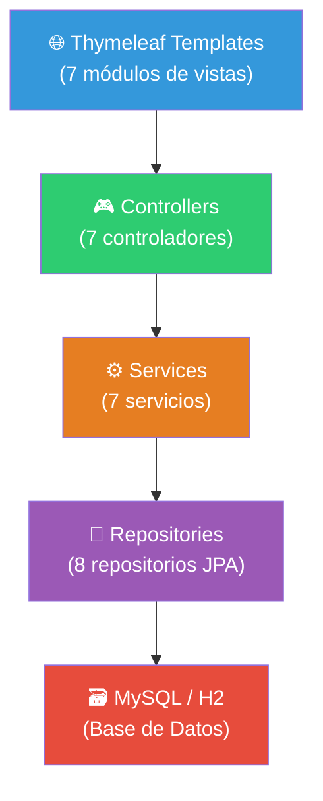
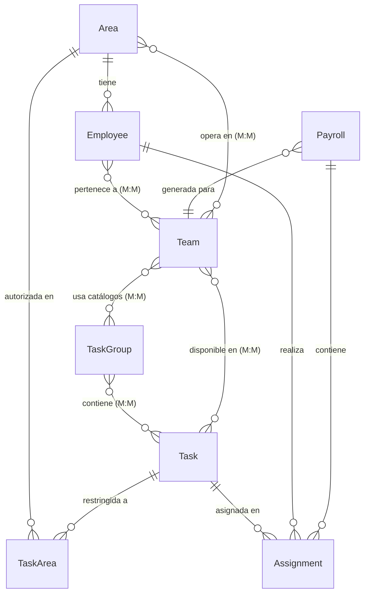
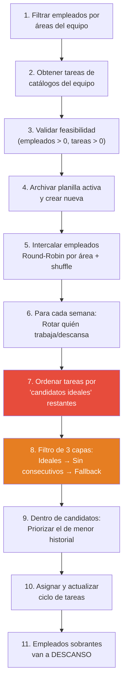
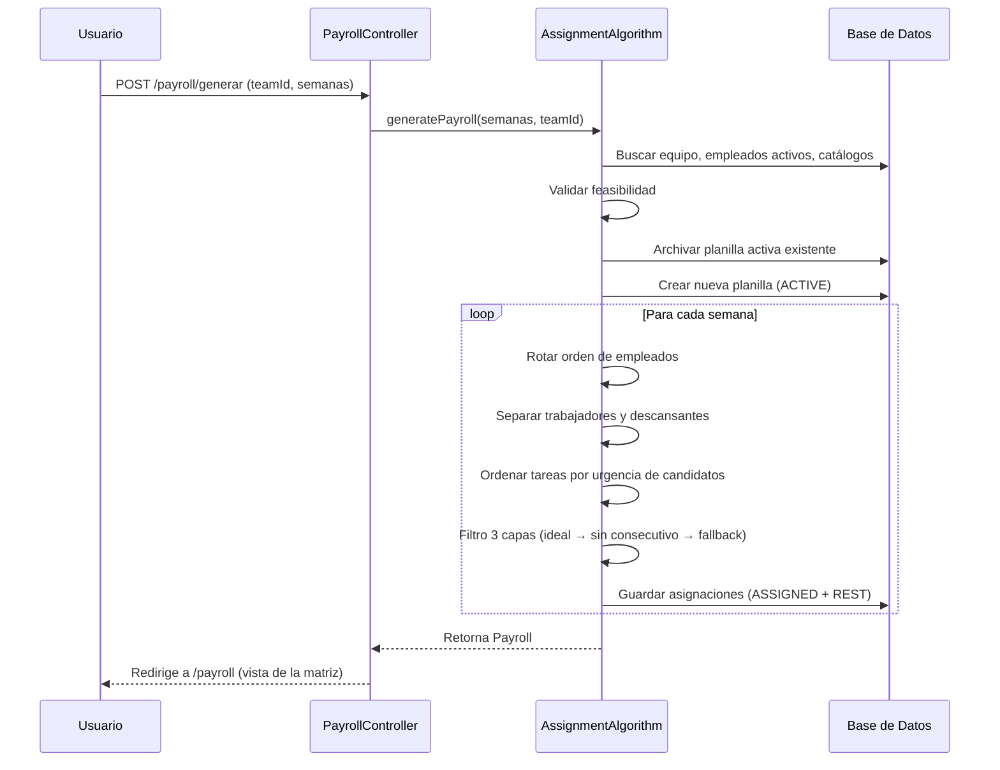

# 📊 Análisis Completo del Proyecto: Task Scheduler

## Resumen Ejecutivo

**Task Scheduler** es un sistema web de gestión de turnos rotativos para empleados, construido con Spring Boot. Su propósito principal es generar **planillas semanales** que asignan tareas a empleados de forma equitativa y rotativa, evitando repeticiones consecutivas.

---

## 🏗️ Stack Tecnológico

| Componente | Tecnología | Versión |
|---|---|---|
| Framework | Spring Boot | **4.0.6** |
| Java | JDK | **17** |
| Build | Maven | 3.x |
| ORM | Hibernate / JPA | (via Spring Boot) |
| Vista | Thymeleaf | (server-side rendering) |
| BD Producción | MySQL | Aiven Cloud |
| BD Desarrollo | H2 | (embebida) |
| Excel | Apache POI | 5.2.3 |
| Boilerplate | Lombok | (annotation processor) |
| Contenedor | Docker | Multi-stage build |

---

## 🧩 Arquitectura de Capas



---

## 📐 Modelo de Dominio

### Diagrama de Entidades



### Detalle de Entidades

#### 1. [Area](file:///c:/task-scheduler/src/main/java/com/taskapp/task_scheduler/model/Area.java) (`areas`)
| Campo | Tipo | Descripción |
|---|---|---|
| `id` | Long | PK auto-increment |
| `nombre` | String(100) | Nombre del área (obligatorio) |
| `descripcion` | String(255) | Descripción opcional |
| `teams` | List\<Team\> | Relación inversa M:M |

#### 2. [Employee](file:///c:/task-scheduler/src/main/java/com/taskapp/task_scheduler/model/Employee.java) (`empleados`)
| Campo | Tipo | Descripción |
|---|---|---|
| `id` | Long | PK auto-increment |
| `name` | String(100) | Nombre (obligatorio) |
| `apellido` | String(100) | Apellido |
| `active` | boolean | Borrado lógico (default: true) |
| `area` | Area | FK obligatoria (M:1) |
| `teams` | List\<Team\> | Equipos asignados (M:M via `empleado_equipo`) |

#### 3. [Task](file:///c:/task-scheduler/src/main/java/com/taskapp/task_scheduler/model/Task.java) (`tareas`)
| Campo | Tipo | Descripción |
|---|---|---|
| `id` | Long | PK auto-increment |
| `name` | String(100) | Nombre (obligatorio) |
| `description` | String(255) | Descripción |
| `type` | TaskType | `GENERAL` o `SPECIFIC` |
| `authorizedAreas` | List\<TaskArea\> | Áreas autorizadas (para SPECIFIC) |
| `teams` | List\<Team\> | Equipos donde está disponible (M:M) |
| `taskGroups` | List\<TaskGroup\> | Catálogos que la contienen (M:M inversa) |

#### 4. [Team](file:///c:/task-scheduler/src/main/java/com/taskapp/task_scheduler/model/Team.java) (`equipos`)
| Campo | Tipo | Descripción |
|---|---|---|
| `id` | Long | PK auto-increment |
| `name` | String(100) | Nombre único (ej: "Sucursal Macul - Turno Mañana") |
| `description` | String(255) | Descripción |
| `employees` | List\<Employee\> | Empleados miembros (M:M inversa) |
| `tasks` | List\<Task\> | Tareas disponibles (M:M inversa) |
| `areas` | List\<Area\> | Áreas operativas (M:M via `equipo_area`) |
| `taskGroups` | List\<TaskGroup\> | Catálogos asignados (M:M via `equipo_catalogo`) |

#### 5. [TaskGroup](file:///c:/task-scheduler/src/main/java/com/taskapp/task_scheduler/model/TaskGroup.java) (`catalogos_tareas`)
Agrupador de tareas. Un catálogo es un "paquete" de tareas que se asigna a un equipo.

#### 6. [Payroll](file:///c:/task-scheduler/src/main/java/com/taskapp/task_scheduler/model/Payroll.java) (`planillas`)
| Campo | Tipo | Descripción |
|---|---|---|
| `id` | Long | PK |
| `startDate` | LocalDate | Inicio del período |
| `endDate` | LocalDate | Fin del período |
| `status` | PayrollStatus | `ACTIVE` o `ARCHIVED` |
| `generatedAt` | LocalDateTime | Timestamp de generación |
| `team` | Team | Equipo para el cual se generó |

#### 7. [Assignment](file:///c:/task-scheduler/src/main/java/com/taskapp/task_scheduler/model/Assignment.java) (`asignaciones`)
| Campo | Tipo | Descripción |
|---|---|---|
| `id` | Long | PK |
| `weekNumber` | int | Número de semana |
| `status` | AssignmentStatus | `ASSIGNED` o `REST` |
| `payroll` | Payroll | FK a planilla |
| `employee` | Employee | FK a empleado |
| `task` | Task | FK a tarea (nullable = descanso) |

---

## 🧠 Algoritmo de Asignación

El corazón del sistema está en [AssignmentAlgorithm](file:///c:/task-scheduler/src/main/java/com/taskapp/task_scheduler/service/AssignmentAlgorithm.java). Es un algoritmo sofisticado de asignación rotativa:

### Flujo del Algoritmo



### Características Clave del Algoritmo

1. **Round-Robin con aleatorización**: Los empleados se intercalan por área y se barajan para evitar patrones fijos
2. **Rotación de descansos**: Cada semana, un subconjunto descansa basándose en el offset `(semana - 1) * descansanCount`
3. **Priorización dinámica de tareas**: Las tareas con menos candidatos "ideales" disponibles se asignan primero (protección del ciclo)
4. **Filtro anti-consecutivos de 3 capas**:
   - **Capa 1**: Empleados que NO hicieron la tarea la semana pasada NI en su ciclo actual
   - **Capa 2**: Empleados que NO la hicieron la semana pasada (aunque ya la hayan hecho en el ciclo)
   - **Capa 3**: Cualquier autorizado (fallback de emergencia)
5. **Ciclo de tareas**: Se lleva un historial por empleado que se resetea cuando ha realizado todas las tareas para las que está autorizado
6. **Autorización por tipo**: Tareas `GENERAL` → cualquier empleado; Tareas `SPECIFIC` → solo empleados del área autorizada

---

## 🌐 Endpoints y Controladores

### [AreaController](file:///c:/task-scheduler/src/main/java/com/taskapp/task_scheduler/controller/AreaController.java) — `/areas`
| Método | Ruta | Acción |
|---|---|---|
| GET | `/areas` | Listar áreas + formulario |
| POST | `/areas/guardar` | Crear área |
| GET | `/areas/editar/{id}` | Formulario edición |
| POST | `/areas/editar/{id}` | Actualizar área |
| GET | `/areas/eliminar/{id}` | Eliminar área |

### [EmployeeController](file:///c:/task-scheduler/src/main/java/com/taskapp/task_scheduler/controller/EmployeeController.java) — `/employees`
| Método | Ruta | Acción |
|---|---|---|
| GET | `/employees` | Listar empleados |
| POST | `/employees/guardar` | Crear empleado |
| GET | `/employees/editar/{id}` | Formulario edición |
| POST | `/employees/editar/{id}` | Actualizar empleado |
| GET | `/employees/desactivar/{id}` | Borrado lógico |
| GET | `/employees/eliminar/{id}` | Borrado físico |

### [TaskController](file:///c:/task-scheduler/src/main/java/com/taskapp/task_scheduler/controller/TaskController.java) — `/tasks`
| Método | Ruta | Acción |
|---|---|---|
| GET | `/tasks` | Listar tareas |
| POST | `/tasks/guardar` | Crear tarea (con área para SPECIFIC) |
| GET | `/tasks/editar/{id}` | Formulario edición |
| POST | `/tasks/editar/{id}` | Actualizar tarea |
| GET | `/tasks/eliminar/{id}` | Eliminar tarea (protege historial) |

### [TaskGroupController](file:///c:/task-scheduler/src/main/java/com/taskapp/task_scheduler/controller/TaskGroupController.java) — `/task-groups`
| Método | Ruta | Acción |
|---|---|---|
| GET | `/task-groups` | Listar catálogos |
| POST | `/task-groups/guardar` | Crear catálogo |
| GET | `/task-groups/editar/{id}` | Editar catálogo + asignar tareas |
| POST | `/task-groups/actualizar` | Guardar tareas del catálogo |
| GET | `/task-groups/eliminar/{id}` | Eliminar catálogo |

### [TeamController](file:///c:/task-scheduler/src/main/java/com/taskapp/task_scheduler/controller/TeamController.java) — `/teams`
| Método | Ruta | Acción |
|---|---|---|
| GET | `/teams` | Listar equipos |
| POST | `/teams/guardar` | Crear equipo |
| GET | `/teams/editar/{id}` | Panel de control del equipo |
| POST | `/teams/actualizar` | Actualizar equipo (áreas + catálogos) |
| GET | `/teams/eliminar/{id}` | Eliminar equipo |
| POST | `/teams/empleado/actualizar` | Editar empleado desde modal |

### [PayrollController](file:///c:/task-scheduler/src/main/java/com/taskapp/task_scheduler/controller/PayrollController.java) — `/payroll`
| Método | Ruta | Acción |
|---|---|---|
| GET | `/payroll` | Ver planilla activa (matriz de turnos) |
| POST | `/payroll/generar` | Generar nueva planilla |
| GET | `/payroll/historial` | Ver planillas archivadas |
| GET | `/payroll/eliminar/{id}` | Eliminar planilla |
| GET | `/payroll/{id}/download` | Descargar Excel |

---

## 🗂️ Estructura de Vistas (Thymeleaf)

```
templates/
├── layout/          → Layout base compartido
├── area/            → CRUD de áreas
├── employee/        → CRUD de empleados
├── task/            → CRUD de tareas
├── taskgroups/      → CRUD de catálogos de tareas
├── teams/           → CRUD de equipos + panel de control
└── payroll/         → Vista de planilla + historial
```

---

## 🐳 Infraestructura

### Docker ([Dockerfile](file:///c:/task-scheduler/Dockerfile))
- **Etapa 1 (build)**: `maven:3.9.6-eclipse-temurin-17` → Compila el JAR
- **Etapa 2 (runtime)**: `eclipse-temurin:17-jre` → Imagen ligera de producción
- Puerto: `8080`

### Base de Datos
- **Producción**: MySQL en Aiven Cloud (`mysql-26d78475-task-scheduler0110.e.aivencloud.com:22513`)
- **Desarrollo**: H2 embebida (datos en `data/taskdb.mv.db`)
- **Esquema**: Gestionado por [schema.sql](file:///c:/task-scheduler/src/main/resources/schema.sql) (tablas de relación M:M) + Hibernate `ddl-auto=none`

---

## ⚠️ Problemas e Inconsistencias Encontradas

### 🔴 Críticos

1. **Dependencia duplicada de MySQL Connector** — en [pom.xml](file:///c:/task-scheduler/pom.xml#L69-L78) el artifact `mysql-connector-j` aparece **dos veces** (líneas 69-73 y 74-78).

2. **`docker-compose.yml` vacío** — El archivo [docker-compose.yml](file:///c:/task-scheduler/docker-compose.yml) existe pero está **completamente vacío**. No hay definición de servicios MySQL ni de la app.

3. **Credenciales de BD en producción** — En [application.properties](file:///c:/task-scheduler/src/main/resources/application.properties#L4-L6) la URL de Aiven y usuario `avnadmin` están hardcoded. La contraseña usa `${DB_PASSWORD}` (variable de entorno), lo cual es bueno, pero el host/usuario debería también parametrizarse.

4. **`DataInitializer` comentado con referencia rota** — El [DataInitializer](file:///c:/task-scheduler/src/main/java/com/taskapp/task_scheduler/config/DataInitializer.java) está **completamente comentado**, pero referencia un método `assignmentAlgorithm.generatePayroll()` sin parámetros que **ya no existe** (ahora requiere `teamId` y `totalWeeks`).

5. **`PayrollRepository.findByStatus()` retorna `Optional`** — En [PayrollRepository](file:///c:/task-scheduler/src/main/java/com/taskapp/task_scheduler/repository/PayrollRepository.java#L13), `findByStatus()` retorna `Optional<Payroll>`, pero si hay **múltiples planillas con el mismo estado** (ej: 2 ARCHIVED), Spring lanzará `IncorrectResultSizeDataAccessException`. Debería ser `List<Payroll>` o agregar lógica para manejar múltiples resultados.

### 🟡 Importantes

6. **Sin seguridad ni autenticación** — No hay Spring Security, login, ni control de acceso. Cualquier persona con la URL puede generar planillas, borrar empleados, etc.

7. **Eliminaciones vía GET** — Endpoints como `/areas/eliminar/{id}`, `/employees/eliminar/{id}`, `/payroll/eliminar/{id}` usan **GET para operaciones destructivas**. Esto viola las buenas prácticas REST y es vulnerable a ataques CSRF o ejecución accidental (ej: un bot indexando links).

8. **Sin manejo global de excepciones** — El directorio `exception/` está **vacío**. Las excepciones lanzan `RuntimeException` o `IllegalStateException` genéricas sin un `@ControllerAdvice` que las capture y muestre un error amigable.

9. **Archivo de código antiguo en `service/`** — El archivo [algoritmoantes.txt](file:///c:/task-scheduler/src/main/java/com/taskapp/task_scheduler/service/algoritmoantes.txt) (26KB) es código legacy guardado como texto plano dentro del directorio de servicios. Debería moverse a documentación o eliminarse.

10. **Inconsistencia de idiomas en el código** — Mezcla de español e inglés en nombres de campos, métodos y comentarios:
    - Modelo: `name` vs `nombre`, `apellido` vs `description`
    - Métodos: `vincularArea()`, `asignarDescanso()`, `getLabelIntuitivo()`
    - Tablas: `tareas`, `empleados`, `planillas` (español) pero campos como `active` (inglés)

### 🟢 Menores

11. **Directorio `dto/` vacío** — El paquete [dto](file:///c:/task-scheduler/src/main/java/com/taskapp/task_scheduler/dto) existe pero no tiene clases. Los controladores pasan entidades JPA directamente a las vistas, lo que es una mala práctica (expone el modelo de datos).

12. **Debug `System.out.println` en producción** — En [PayrollController](file:///c:/task-scheduler/src/main/java/com/taskapp/task_scheduler/controller/PayrollController.java#L58-L69) hay múltiples `System.out.println` de debug que deberían reemplazarse por un Logger.

13. **`FeasibilityValidator` incompleto** — El [FeasibilityValidator](file:///c:/task-scheduler/src/main/java/com/taskapp/task_scheduler/service/FeasibilityValidator.java) solo valida que haya empleados y tareas. Tiene un TODO para validar que empleados de áreas específicas tengan tareas compatibles.

14. **Falta de tests** — El directorio `src/test/java` existe pero no se observan archivos de test.

15. **`@Data` de Lombok en entidades JPA** — Usar `@Data` en entidades con relaciones bidireccionales puede causar **StackOverflowError** en `toString()`, `hashCode()` y `equals()` por referencias circulares. Se recomienda usar `@Getter`, `@Setter` y definir `equals`/`hashCode` manualmente.

---

## 📊 Métricas del Proyecto

| Métrica | Valor |
|---|---|
| Archivos Java | **~30** |
| Entidades JPA | **8** (Area, Employee, Task, Team, TaskGroup, Payroll, Assignment, TaskArea) |
| Controladores | **7** |
| Servicios | **7** |
| Repositorios | **8** |
| Tablas de relación M:M | **5** (schema.sql) |
| Módulos de vistas | **7** |
| Líneas de algoritmo | **224** |

---

## 🔄 Flujo de Negocio Principal



---

## 💡 Recomendaciones de Mejora

1. **Seguridad**: Agregar Spring Security con autenticación básica/JWT
2. **Refactorizar eliminaciones a POST/DELETE** para evitar vulnerabilidades CSRF
3. **Implementar DTOs** para separar el modelo de datos de las vistas
4. **Agregar `@ControllerAdvice`** con páginas de error personalizadas
5. **Reemplazar `System.out.println`** por SLF4J Logger
6. **Usar `@Getter`/`@Setter`** en lugar de `@Data` en entidades JPA
7. **Escribir tests unitarios** para el `AssignmentAlgorithm` (es la lógica más crítica)
8. **Completar `docker-compose.yml`** con servicio MySQL y la app
9. **Eliminar la dependencia duplicada** de `mysql-connector-j`
10. **Estandarizar idioma** del código (preferiblemente todo en inglés o todo en español)
