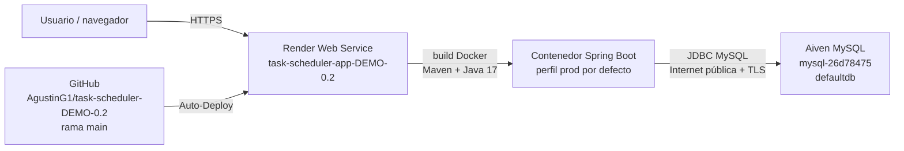

# Arquitectura de despliegue

Revisión realizada el 27 de septiembre de 2026 a partir del repositorio local, el panel autenticado de Render, la aplicación pública y el panel autenticado de Aiven. No se copiaron contraseñas, cadenas de conexión completas ni valores secretos.

## Diagrama general



No hay frontend separado, worker, tarea cron, Redis ni base administrada por Render. Es un monolito Spring Boot servido desde un único Web Service y una base MySQL externa.

## Render

| Dato | Configuración observada |
|---|---|
| Proyecto | `My project` |
| Entorno | `Production` |
| Servicio | `task-scheduler-app-DEMO-0.2` |
| Tipo | Web Service, runtime Docker |
| Service ID | `srv-d865g9rbc2fs73fcl540` |
| Plan | Free |
| Región | Ohio (US East) |
| Fuente | GitHub `AgustinG1/task-scheduler-DEMO-0.2` |
| Rama | `main` |
| Directorio raíz | raíz del repositorio |
| Dockerfile | `./Dockerfile` |
| Contexto Docker | `.` |
| Comando Docker adicional | ninguno; se utiliza el `ENTRYPOINT` de la imagen |
| URL pública | `https://task-scheduler-app-demo-0-2.onrender.com/` |

Los despliegues recientes aparecen disparados por Auto-Deploy. El despliegue marcado como `Live` corresponde al commit `a6c203360fcd1da6d218bb849782019c6d8fa057`. El plan gratuito suspende la instancia por inactividad; Render advierte que el primer acceso puede tardar 50 segundos o más. Esta revisión observó la pantalla de reactivación al abrir la URL pública.

La copia local contiene correcciones posteriores del algoritmo y pruebas que todavía no pertenecen a ese commit. Por ello, el resultado local de 11 pruebas correctas no describe todavía el código que atiende la URL pública. Para llevar esos cambios a producción habrá que incorporarlos al repositorio Git, ejecutar las pruebas, subirlos a `main` y comprobar un nuevo despliegue `Live`.

## Construcción y ejecución del contenedor

El `Dockerfile` tiene dos etapas:

1. `maven:3.9.6-eclipse-temurin-17` copia `pom.xml` y `src`, y ejecuta `mvn clean package -DskipTests`.
2. `eclipse-temurin:17-jre` copia el JAR como `/app/app.jar`, expone 8080 y arranca con `java -jar app.jar`.

Render no reemplaza el comando de inicio. Spring Boot escucha en 8080 porque el proyecto no define otro `server.port`. El build de producción omite las pruebas; la calidad depende de ejecutarlas antes de subir cambios o de añadir integración continua.

No existe `render.yaml`. La infraestructura se configura manualmente en el Dashboard, por lo que el repositorio no basta para reconstruir íntegramente el servicio. Los identificadores y esta documentación permiten ubicarlo, pero cambios de región, plan, variables o políticas de despliegue pueden quedar fuera del historial Git.

## Variables de entorno de Render

El servicio tiene configuradas estas claves; sus valores permanecieron ocultos:

| Variable | Función |
|---|---|
| `SPRING_DATASOURCE_URL` | URL JDBC completa hacia Aiven |
| `SPRING_DATASOURCE_USERNAME` | usuario de MySQL |
| `SPRING_DATASOURCE_PASSWORD` | contraseña de MySQL |
| `DB_PASSWORD` | variable heredada o duplicada; no es necesaria cuando `SPRING_DATASOURCE_PASSWORD` está presente |

No se observó `SPRING_PROFILES_ACTIVE`, por lo que `application.properties` selecciona `prod` como perfil predeterminado. Las variables `SPRING_DATASOURCE_*` tienen precedencia sobre `application-prod.properties`; por eso Render puede conectarse sin definir `DB_HOST`, `DB_PORT`, `DB_NAME` y `DB_USERNAME`. La URL JDBC guardada en Render debe conservar TLS obligatorio, coherente con el requisito `REQUIRED` mostrado por Aiven.

Evitar documentar o versionar los valores reales. Para rotar credenciales, actualizar Aiven y Render de forma coordinada y verificar la conexión antes de retirar las anteriores.

## Aiven MySQL

| Dato | Configuración observada |
|---|---|
| Proyecto | `task-scheduler0110` |
| Servicio | `mysql-26d78475` |
| Motor | MySQL 8.4.8 |
| Estado | Running |
| Nodos | 1 |
| Base usada | `defaultdb` |
| SSL | REQUIRED |
| Recursos mostrados | 1 CPU, 1 GB RAM, 1 GB de almacenamiento |
| Proveedor / región | DigitalOcean, `sfo` |
| Modelo de red | Internet pública |
| Lista de IP permitidas | abierta a todas las direcciones |
| Ventana de mantenimiento | jueves después de 23:15 UTC |

La aplicación en Ohio se conecta a una base en `sfo`; esto agrega distancia de red a cada consulta. La base está expuesta por Internet y depende de autenticación y TLS. La lista de IP abierta a todas las direcciones aumenta la superficie de acceso: conviene restringirla cuando exista una estrategia estable para las direcciones de salida de Render. No cambiarla sin comprobar antes qué direcciones utiliza el servicio, porque una regla incorrecta cortaría producción.

## Perfiles locales y Docker Compose

`docker-compose.yml` no representa la infraestructura real de producción. Levanta dos contenedores locales: la aplicación con perfil `docker` y MySQL 8.4 en la red de Compose, con un volumen `mysql_data`. Sus credenciales fijas son solo para desarrollo. Producción utiliza Render y Aiven, el perfil predeterminado `prod` y secretos almacenados en Render.

El perfil `local` utiliza H2 en memoria y es el usado por JUnit. Ninguna prueba local escribe en Aiven.

## Flujo de entrega actual

```text
cambio local → pruebas Maven → commit/push a GitHub main
             → Auto-Deploy de Render → build Docker sin pruebas
             → arranque Spring Boot → conexión TLS a Aiven
             → verificación de URL, logs y operación básica
```

Antes de considerar un despliegue terminado, comprobar: nuevo commit marcado `Live`, respuesta de la URL pública después del posible arranque en frío, ausencia de errores de conexión en logs y una operación de lectura/escritura controlada. El Dashboard no tiene configurada una ruta de health check dedicada; la aplicación tampoco expone actualmente Spring Boot Actuator.

## Enlaces operativos

- [Proyecto en Render](https://dashboard.render.com/project/prj-d865g9n7f7vs739m8se0)
- [Servicio web en Render](https://dashboard.render.com/web/srv-d865g9rbc2fs73fcl540)
- [Aplicación pública](https://task-scheduler-app-demo-0-2.onrender.com/)
- [Servicio MySQL en Aiven](https://console.aiven.io/account/a5b52463528c/project/task-scheduler0110/services/mysql-26d78475/overview)
- [Repositorio GitHub](https://github.com/AgustinG1/task-scheduler-DEMO-0.2/tree/main)
